# Parkway Shenton Clinic Registration Automation

## Overview

This skill enables the AI Agent to automate the administrative steps of registering patients, interpreting medical chits/referral letters, matching insurance coverage/screening packages, and pre-filling the required General and Occupational Health screening questionnaires.

By automating these processes, clinic staff can reduce registration bottlenecks, eliminate manual data entry, and improve patient throughput.

```mermaid
sequenceDiagram
    autonumber
    actor Patient
    actor Staff as Clinic Counter Staff
    participant Agent as AI Agent
    participant DB as Patient Registration DB
    participant Form as Questionnaire System

    Patient->>Staff: Arrives with Medical Chit / ID
    Staff->>Agent: Uploads Chit / Scans ID
    rect rgb(30, 41, 59)
        note right of Agent: Automation Flow
        Agent->>Agent: Extract Chit text (extract_document_text.py)
        Agent->>DB: Query Patient (query_patients.py)
        Agent->>Agent: Match Package Eligibility (match_eligibility.py)
        Agent->>Form: Pre-populate Questionnaire (generate_prefill.py)
    end
    Agent->>Staff: Output Mapped Package, Covered Tests & Form Link
    Staff->>Patient: Verify Identity & Provide Pre-filled Form link
```



---

## Prerequisites

Ensure the following dependencies are installed:
- `pandas`
- `python-docx`
- `python-pptx`

Install them using:
```bash
pip install pandas python-docx python-pptx
```

---

## Core Automation Steps

### 1. Document Extraction
When a patient presents a medical chit, referral letter, or voucher (e.g. in Word `.docx`, PowerPoint `.pptx`, or raw text format), extract the contents using:
```bash
python .agents/skills/hack4health-clinic-automation/scripts/extract_document_text.py <path_to_chit_file>
```

### 2. Patient Database Lookup
Verify if the patient exists in the synthetic registration database using their Name or NRIC/FIN:
```bash
# Search by name
python .agents/skills/hack4health-clinic-automation/scripts/query_patients.py --name "Loh Amir"

# Search by NRIC/FIN/Passport
python .agents/skills/hack4health-clinic-automation/scripts/query_patients.py --id "S8536477Z"
```

### 3. Eligibility and Package Matching
Match the patient's age (computed based on current year 2026) and the insurer/TPA code from the chit to determine their screening package:
```bash
python .agents/skills/hack4health-clinic-automation/scripts/match_eligibility.py --code "BLPHS" --dob "25/01/05" --gender "Male"
```

#### Mapped Insurer & TPA Rules:
- **Bluepeak Wellness (`BLPHS`)**: Wellness packages based on age in 2026:
  - **`WELL1` (Essential)**: Under 40 years old.
  - **`WELL2` (Comprehensive)**: 40 to 59 years old.
  - **`WELL3` (Executive)**: 60 years old and above.
- **Bluepeak Underwriting (`BLPDE`)**: Full Medical Exam + Anti-HIV Test (`BP#HIV`).
- **Ministry of Learning (`MOL0199VME`)**: Civil Service Medical Scheme based on age:
  - **`PEE225`**: 24 and below.
  - **`PEE226`**: 25 to 49.
  - **`PEE224`**: 50 and above.
- **Meridian Life (`MRDEB`)**: Chest X-Ray, HIV Antibody Test, Treadmill ECG.
- **Everwell Health Voucher (`EVWME`)**: Medical Exam, Lipid Profile, UFEME, Resting ECG.
- **Everwell Underwriting (`EVWPA`)**: Adult Medical Examination.
- **Northstar Life (`NSTNBU`)**: Underwriting follow-up (two repeat urine exams on different days).

### 4. Questionnaire Pre-population
Generate the pre-filled JSON survey payload for the Parkway Shenton questionnaires (`general` or `occupational`) so the patient does not need to re-enter demographic details:
```bash
python .agents/skills/hack4health-clinic-automation/scripts/generate_prefill.py --id "S8536477Z" --type "general"
```

---

## Interpretation Guidelines for the Agent

When executing this workflow, the AI Agent must synthesize the outputs and present them to the clinic staff as follows:

1. **Patient Match Notification**:
   - Confirm if the patient was found in the database.
   - Flag if there are any discrepancies (e.g., mismatched DOB, different spelling of name, or updated email).
2. **Insurer & Package Resolution**:
   - State the parsed insurer name and TPA/Policy Code.
   - List the mapped medical screening package and all covered examinations/tests.
   - Explicitly highlight any tests requested in the chit that are **not** covered by the standard package (which may require manual approval or co-payment).
3. **Safety / Allergy Alert**:
   - **MANDATORY**: Check the patient record for `Drug Allergy`. If present, format it as a highly prominent warning (e.g., `> [!WARNING] DRUG ALLERGY: Penicillin`).
4. **Pre-filled Form Generation**:
   - Provide the generated JSON payload or form link for the staff to pass to the patient.
